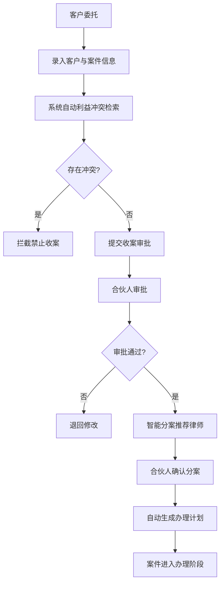
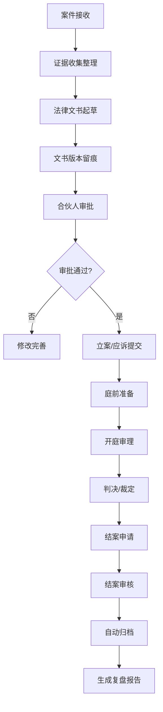
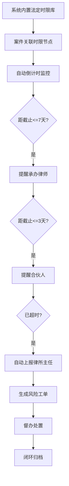
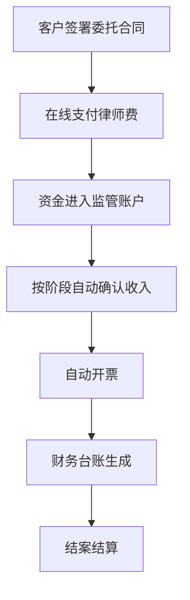

# 产品需求文档：律所案件管理与合规风控平台

## 1. 产品概述

本平台为律所一体化案件管理与合规风控平台，面向客户、律师助理、执业律师、合伙人、律所主任，实现收案审批、案件办理、时限风控、文书留痕、费用管理、卷宗归档、司法数据同步、合规监管、经营大屏全链路数字化。

平台以合规执业、风险可控、流程可溯、效率提升为核心，严格遵守《律师法》《律师执业管理办法》《利益冲突审查规定》《收费管理办法》，满足律所内部管理、司法监管、财务合规、风险防控要求。

## 2. 核心功能

### 2.1 用户角色

| 角色 | 注册方式 | 核心权限 |
|------|----------|----------|
| 客户 | 手机号注册/律所邀请 | 查看案件进度、在线支付、文书查看、投诉反馈 |
| 律师助理 | 管理员添加 | 立案、材料整理、文书初稿、开庭登记、客户沟通、进度录入 |
| 执业律师 | 管理员添加 | 案件办理、文书编辑、出庭登记、时限处理、客户服务、结案申请 |
| 合伙人 | 管理员添加 | 分案审批、质量监督、风险把控、预警督办、团队管理、结案审核 |
| 律所主任 | 管理员添加 | 全局监控、合规监管、经营大屏、报表管理、系统配置、决策支持 |

### 2.2 功能模块

1. **登录首页**：工作台、数据概览、待办事项、快捷入口
2. **案件管理**：案件列表、案件详情、收案登记、分案管理、进度跟踪
3. **客户管理**：客户档案、客户委托、客户沟通记录、满意度
4. **文书管理**：文书模板、在线编辑、版本留痕、文书审批
5. **费用管理**：收费管理、开票管理、财务台账、风险代理管控
6. **时限风控**：时限监控、多级预警、风险工单、督办管理
7. **司法数据**：开庭公告、裁判文书、送达公告、案件流程同步
8. **卷宗归档**：电子卷宗、自动归档、档案检索、借阅管理
9. **经营大屏**：数据驾驶舱、多维统计、报表导出
10. **系统管理**：用户权限、组织架构、系统配置、操作日志

### 2.3 页面详情

| 页面名称 | 模块名称 | 功能描述 |
|---------|---------|----------|
| 登录页 | 身份认证 | 用户登录、角色选择、密码找回 |
| 工作台 | 数据概览 | 在办案件数、待办事项、时限预警、快捷操作 |
| 案件列表 | 案件管理 | 案件筛选、案件搜索、案件状态、批量操作 |
| 案件详情 | 案件管理 | 基本信息、案件进度、当事人、证据、文书、费用、日志 |
| 收案登记 | 收案管理 | 客户信息录入、委托事项、利益冲突检索、收案审批 |
| 分案管理 | 案件管理 | 律师推荐、分案审批、案件分配、办理计划 |
| 客户列表 | 客户管理 | 客户档案、客户分类、委托记录、沟通记录 |
| 文书中心 | 文书管理 | 模板库、在线编辑、版本管理、审批流转 |
| 费用中心 | 费用管理 | 收费记录、开票管理、台账报表、风险代理 |
| 时限监控 | 风控中心 | 时限列表、预警状态、多级提醒、超时上报 |
| 风险工单 | 风控中心 | 工单列表、工单处理、风险闭环、统计分析 |
| 司法数据 | 数据同步 | 开庭公告、裁判文书、送达公告、流程信息 |
| 卷宗管理 | 归档管理 | 电子卷宗、归档申请、档案检索、借阅审批 |
| 经营大屏 | 数据驾驶舱 | 实时数据、多维图表、筛选维度、报表导出 |
| 用户管理 | 系统设置 | 用户列表、角色权限、组织架构、律师画像 |
| 操作日志 | 系统设置 | 全量日志、审计追溯、日志查询、日志导出 |

## 3. 核心流程

### 3.1 收案与分案流程

客户委托 → 录入客户与案件信息 → 系统自动利益冲突检索 → 无冲突则提交收案审批 → 合伙人审批通过 → 智能分案（推荐律师） → 合伙人确认分案 → 自动生成办理计划 → 案件进入办理阶段

### 3.2 案件办理流程

案件接收 → 证据收集 → 文书起草 → 文书审批 → 立案/应诉 → 庭前准备 → 开庭审理 → 判决/裁定 → 结案申请 → 结案审核 → 自动归档 → 复盘报告

### 3.3 时限风控流程

系统内置法定时限库 → 案件关联时限节点 → 自动倒计时监控 → 提前7天提醒律师 → 提前3天提醒合伙人 → 超时自动上报主任 → 风险工单生成 → 督办处置 → 闭环归档

### 3.4 费用管理流程

客户签署委托合同 → 在线支付律师费 → 资金进入监管账户 → 按阶段自动确认收入 → 自动开票 → 财务台账生成 → 结案结算

## 4. 用户界面设计

### 4.1 设计风格

**设计理念**：专业、严谨、可信、高效

- **主色调**：深邃藏青色 (#0F2B5B) - 代表法律的庄严与专业
- **辅助色**：金棕色 (#B8860B) - 代表权威与品质
- **强调色**：正红色 (#C41E3A) - 用于风险预警与重要提醒
- **成功色**：墨绿色 (#2E7D32) - 用于正常状态与通过
- **中性色**：深灰 (#333333)、中灰 (#666666)、浅灰 (#F5F7FA)、白色 (#FFFFFF)

**按钮风格**：
- 主按钮：藏青色填充、圆角6px、悬停微亮
- 次按钮：边框按钮、悬停填充
- 危险按钮：红色填充、用于删除/拒绝操作

**字体**：
- 标题：思源宋体 / Noto Serif SC - 专业感、书卷气
- 正文：思源黑体 / Noto Sans SC - 清晰易读
- 数字/数据：等宽字体 - 数据展示精准

**布局风格**：
- 左侧导航 + 顶部栏 + 内容区的经典后台布局
- 卡片式内容展示，层次分明
- 大量留白，信息密度适中
- 表格为主，辅以图表可视化

**图标风格**：线性图标，2px线条，统一圆角，专业简洁

### 4.2 页面设计概览

| 页面名称 | 模块名称 | UI元素 |
|---------|---------|-------|
| 登录页 | 身份认证 | 品牌Logo、登录表单、角色切换、法律纹饰背景 |
| 工作台 | 数据概览 | 数据卡片、待办列表、时限预警、快捷入口、图表 |
| 案件列表 | 案件管理 | 筛选栏、数据表格、分页、批量操作、状态标签 |
| 案件详情 | 案件管理 | 信息分区、Tab切换、时间轴、操作按钮 |
| 经营大屏 | 数据驾驶舱 | 深色背景、大屏图表、数据动效、实时更新 |
| 时限监控 | 风控中心 | 倒计时卡片、预警等级、状态颜色、提醒记录 |
| 文书编辑 | 文书管理 | 富文本编辑器、版本历史、审批流程、留痕记录 |

### 4.3 响应式设计

- **桌面端优先**：主要面向办公场景，优先保证1920x1080及以上分辨率体验
- **平板适配**：导航可折叠，内容区自适应
- **手机适配**：底部导航、卡片堆叠、关键信息优先展示
- **触控优化**：按钮最小44x44px，手势操作支持

### 4.4 动效与交互

- 页面切换：淡入淡出，平滑过渡
- 数据加载：骨架屏占位，渐进式呈现
- 预警提醒：脉冲动画，吸引注意
- 图表数据：数值递增动画，直观生动
- 悬停反馈：微妙的阴影与颜色变化
- 操作反馈：成功/失败的Toast提示

## 5. 强合规规则

1. **收案前必须自动利益冲突检索**，冲突禁止收案
2. **诉讼时效/举证期限/上诉期必须自动预警**，不可漏预警
3. **文书修改必须全程留痕**，满足司法合规与律所质控
4. **收费必须进入律所账户**，按阶段自动结算、自动开票
5. **案件必须自动归档**，电子卷宗完整可查
6. **所有操作日志留存**，不可篡改、可审计、可倒查
