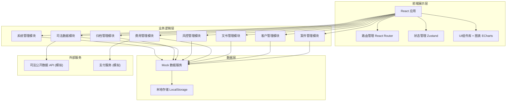
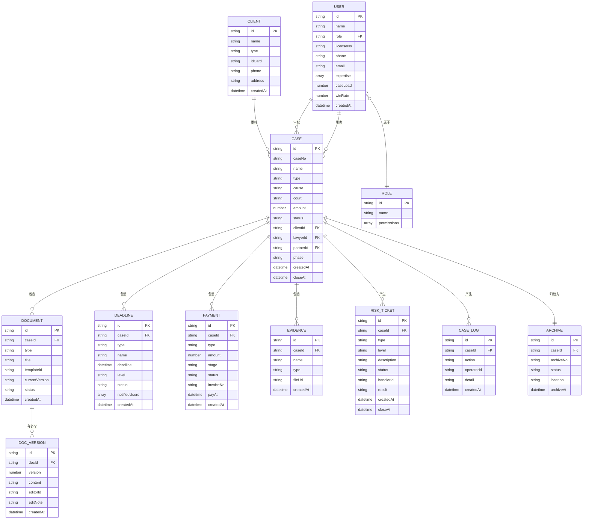

# 技术架构文档：律所案件管理与合规风控平台

## 1. 架构设计



## 2. 技术描述

- **前端框架**: React@18 + TypeScript
- **构建工具**: Vite@5
- **样式方案**: TailwindCSS@3 + CSS变量
- **路由管理**: React Router v6
- **状态管理**: Zustand
- **UI组件**: 自研组件库（基于设计规范）
- **图表可视化**: ECharts@5
- **图标方案**: Lucide React
- **富文本编辑**: Quill / TipTap
- **数据持久化**: LocalStorage (模拟后端)
- **Mock数据**: 内置模拟数据服务

## 3. 路由定义

| 路由路径 | 页面名称 | 权限角色 | 说明 |
|---------|---------|---------|------|
| /login | 登录页 | 全部 | 用户身份认证 |
| /dashboard | 工作台 | 全部登录用户 | 数据概览与快捷入口 |
| /cases | 案件列表 | 律师/助理/合伙人/主任 | 案件列表与筛选 |
| /cases/:id | 案件详情 | 律师/助理/合伙人/主任 | 案件全量信息 |
| /cases/new | 收案登记 | 助理/律师/合伙人 | 新建案件与冲突检索 |
| /cases/assign | 分案管理 | 合伙人/主任 | 智能分案与审批 |
| /clients | 客户列表 | 律师/助理/合伙人/主任 | 客户档案管理 |
| /clients/:id | 客户详情 | 律师/助理/合伙人/主任 | 客户详细信息 |
| /documents | 文书中心 | 律师/助理/合伙人/主任 | 文书模板与编辑 |
| /documents/:id | 文书编辑 | 律师/助理/合伙人/主任 | 在线编辑与留痕 |
| /finance | 费用中心 | 合伙人/主任 | 收费与财务台账 |
| /finance/invoice | 开票管理 | 合伙人/主任 | 发票管理 |
| /risk/deadlines | 时限监控 | 全部登录用户 | 时限预警与提醒 |
| /risk/tickets | 风险工单 | 合伙人/主任 | 风险工单处理 |
| /judicial | 司法数据 | 律师/助理/合伙人/主任 | 司法公开数据同步 |
| /archive | 卷宗管理 | 律师/助理/合伙人/主任 | 电子卷宗归档 |
| /analytics | 经营大屏 | 合伙人/主任 | 数据驾驶舱 |
| /system/users | 用户管理 | 主任 | 用户与权限管理 |
| /system/logs | 操作日志 | 主任 | 审计日志查询 |
| /system/settings | 系统设置 | 主任 | 系统参数配置 |

## 4. 数据模型定义

### 4.1 实体关系图



### 4.2 核心数据类型

```typescript
// 用户
interface User {
  id: string;
  name: string;
  role: 'client' | 'assistant' | 'lawyer' | 'partner' | 'director';
  licenseNo?: string;
  phone: string;
  email?: string;
  avatar?: string;
  expertise?: string[];
  caseLoad?: number;
  winRate?: number;
  status: 'active' | 'inactive';
  createdAt: string;
}

// 客户
interface Client {
  id: string;
  name: string;
  type: 'individual' | 'enterprise';
  idCard?: string;
  creditCode?: string;
  phone: string;
  email?: string;
  address?: string;
  industry?: string;
  contactPerson?: string;
  remark?: string;
  createdAt: string;
}

// 案件
interface Case {
  id: string;
  caseNo: string;
  name: string;
  type: 'civil' | 'criminal' | 'administrative' | 'commercial' | 'labor' | 'other';
  cause: string;
  court: string;
  judge?: string;
  amount: number;
  status: 'pending' | 'intake' | 'accepted' | 'assigned' | 'in_progress' | 'trial' | 'judgment' | 'closed' | 'archived';
  phase: 'intake' | 'pre_trial' | 'trial' | 'judgment' | 'enforcement' | 'closed';
  clientId: string;
  clientName: string;
  oppositeParty: string;
  lawyerId?: string;
  lawyerName?: string;
  partnerId?: string;
  partnerName?: string;
  assistantId?: string;
  assistantName?: string;
  evidenceSummary?: string;
  description?: string;
  conflictCheckResult?: 'pass' | 'fail' | 'pending';
  createdAt: string;
  acceptedAt?: string;
  closeAt?: string;
}

// 文书
interface Document {
  id: string;
  caseId: string;
  type: string;
  title: string;
  templateId?: string;
  currentVersion: number;
  status: 'draft' | 'reviewing' | 'approved' | 'rejected';
  content?: string;
  versions?: DocVersion[];
  createdAt: string;
  updatedAt: string;
}

// 文书版本
interface DocVersion {
  id: string;
  docId: string;
  version: number;
  content: string;
  editorId: string;
  editorName: string;
  editNote: string;
  createdAt: string;
}

// 时限
interface Deadline {
  id: string;
  caseId: string;
  caseName: string;
  type: 'lawsuit' | 'evidence' | 'defense' | 'appeal' | 'announcement' | 'enforcement' | 'other';
  name: string;
  deadline: string;
  remainingDays: number;
  level: 'normal' | 'warning' | 'urgent' | 'overdue';
  status: 'pending' | 'completed';
  notifiedLawyer: boolean;
  notifiedPartner: boolean;
  notifiedDirector: boolean;
  createdAt: string;
}

// 费用
interface Payment {
  id: string;
  caseId: string;
  caseName: string;
  clientName: string;
  type: 'fixed' | 'proportion' | 'risk';
  amount: number;
  paidAmount: number;
  stage: 'intake' | 'pre_trial' | 'trial' | 'judgment' | 'enforcement';
  status: 'unpaid' | 'partial' | 'paid' | 'refunded';
  invoiceNo?: string;
  invoiceStatus: 'none' | 'issued' | 'void';
  payAt?: string;
  remark?: string;
  createdAt: string;
}

// 风险工单
interface RiskTicket {
  id: string;
  caseId: string;
  caseName: string;
  type: 'complaint' | 'fee_dispute' | 'major_risk' | 'lawyer_change' | 'delay' | 'deadline_overdue' | 'other';
  level: 'low' | 'medium' | 'high' | 'critical';
  title: string;
  description: string;
  status: 'pending' | 'processing' | 'resolved' | 'closed';
  reporterId: string;
  reporterName: string;
  handlerId?: string;
  handlerName?: string;
  result?: string;
  createdAt: string;
  closeAt?: string;
}

// 操作日志
interface OperationLog {
  id: string;
  userId: string;
  userName: string;
  module: string;
  action: string;
  targetId: string;
  targetName: string;
  detail: string;
  ip: string;
  createdAt: string;
}
```

## 5. 目录结构

```
src/
├── assets/              # 静态资源
│   ├── images/
│   └── fonts/
├── components/          # 通用组件
│   ├── layout/         # 布局组件
│   ├── ui/             # 基础UI组件
│   ├── charts/         # 图表组件
│   └── common/         # 业务组件
├── pages/              # 页面组件
│   ├── Login/
│   ├── Dashboard/
│   ├── Cases/
│   ├── Clients/
│   ├── Documents/
│   ├── Finance/
│   ├── Risk/
│   ├── Judicial/
│   ├── Archive/
│   ├── Analytics/
│   └── System/
├── store/              # 状态管理
│   ├── useUserStore.ts
│   ├── useCaseStore.ts
│   └── ...
├── services/           # 服务层
│   ├── mock/           # Mock数据
│   ├── caseService.ts
│   ├── clientService.ts
│   └── ...
├── hooks/              # 自定义Hooks
├── utils/              # 工具函数
├── types/              # 类型定义
├── constants/          # 常量配置
├── styles/             # 全局样式
├── router/             # 路由配置
├── App.tsx
└── main.tsx
```

## 6. 核心技术方案

### 6.1 状态管理方案

使用 Zustand 进行状态管理，按业务模块划分 store：
- useUserStore: 用户信息、权限
- useCaseStore: 案件数据
- useDocumentStore: 文书数据
- useNotificationStore: 通知提醒

### 6.2 权限控制方案

基于角色的访问控制（RBAC）：
- 路由级权限：通过路由守卫控制页面访问
- 组件级权限：通过权限指令控制按钮/模块显示
- 数据级权限：根据角色过滤可见数据范围

### 6.3 时限预警方案

- 系统启动时计算所有时限剩余天数
- 设置定时器每小时重新计算
- 根据剩余天数自动更新预警级别
- 支持浏览器通知 + 页面内提醒

### 6.4 文书留痕方案

- 每次保存生成新版本
- 记录编辑人、编辑时间、修改备注
- 支持版本对比与回滚
- 版本历史不可删除

### 6.5 数据模拟方案

- 使用 JSON 文件 + 工具函数模拟后端 API
- 数据持久化到 LocalStorage
- 支持 CRUD 操作
- 实现分页、筛选、排序等功能
